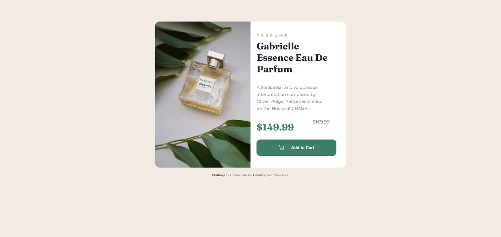

# Frontend Mentor - Product preview card component solution

This is a solution to the [Product preview card component challenge on Frontend Mentor](https://www.frontendmentor.io/challenges/product-preview-card-component-GO7UmttRfa). Frontend Mentor challenges help you improve your coding skills by building realistic projects. 

## Table of contents

- [Overview](#overview)
  - [The challenge](#the-challenge)
  - [Screenshot](#screenshot)
  - [Links](#links)
- [My process](#my-process)
  - [Built with](#built-with)
  - [What I learned](#what-i-learned)
  - [Continued development](#continued-development)
  - [Useful resources](#useful-resources)
- [Author](#author)


**Note: Delete this note and update the table of contents based on what sections you keep.**

## Overview

### The challenge

Users should be able to:

- View the optimal layout depending on their device's screen size
- See hover and focus states for interactive elements

### Screenshot




### Links

- Solution URL: [Product preview](https://github.com/GleberC/product-preview-card-component)
- Live Site URL: [[Product preview](https://product-preview-card-component-six-puce.vercel.app/)

## My process

### Built with

- Semantic HTML5 markup
- CSS custom properties
- Flexbox
- CSS Grid
- Mobile-first workflow


### What I learned

In this challenge, I learned how to work with screens according to the device, with mobile-first as the base. I was able to learn how to handle layouts under these conditions by working with the dimensions of the containers and ensuring everything functions with an appropriate aesthetic. I was able to use different image crops, for example, to achieve this visual adaptation according to the objective.

To see how you can add code snippets, see below:

```html
 
```
```css
img {
    max-inline-size: 100%;
    width: 350px;
    height: 250px;
    object-fit: cover;
    object-position: center;
    border-radius: .8rem .8rem 0 0;
}

@media (min-width:700px) {
    img {
        max-inline-size: 50%;
        block-size: auto;
        border-radius: 1rem 0 0 1rem;
    }}
```

### Continued development

I will continue to focus on improving responsive layouts. I also need to learn about JavaScript.


## Author

- Website - [Gleber](https://github.com/GleberC)
- Frontend Mentor - [GleberC](https://www.frontendmentor.io/profile/GleberC)


